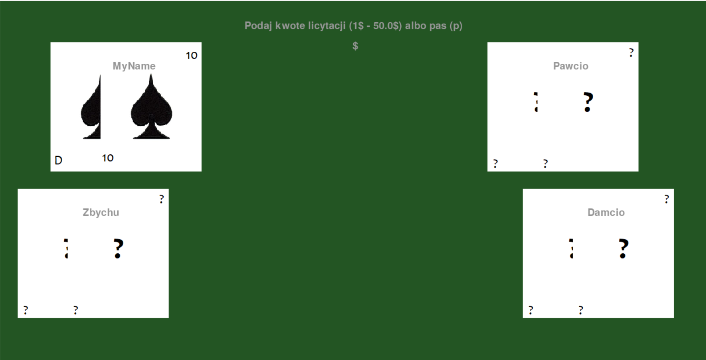
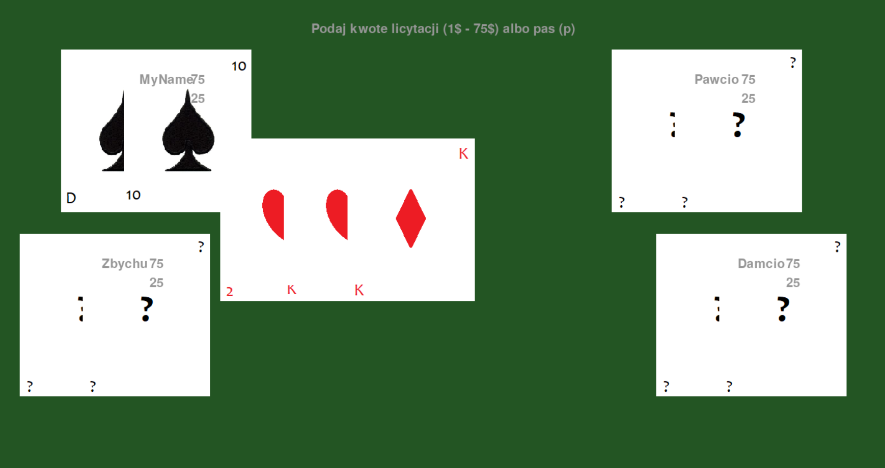
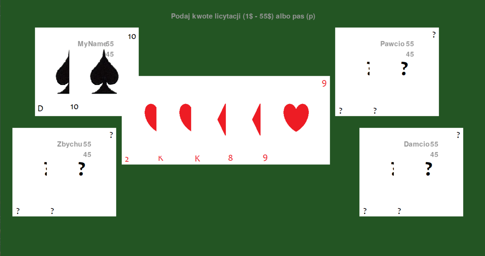
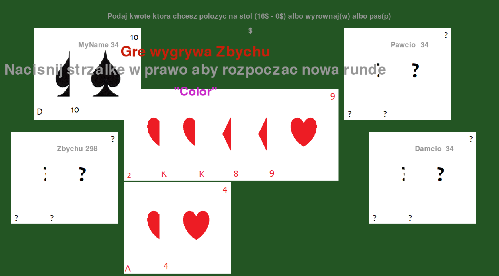

# Poker
# Projekt PIPR 22Z
## Treść projektu
### Celem projektu jest zaimplementowanie gry w pokera w odmianie Texas Hold'em zasady.
#### Powinna być możliwość gry jednoosobowej przeciwko wielu graczom komputerowym. Gra komputera powinna cechować się decyzjami zwiększającymi prawdopodobieństwo wygranej komputera. Nie musi być to optymalny model decyzji, ale powinien być zauważalnie lepszy niż losowe decyzje.
##### Stworzone przy pomocy
[](https://www.pygame.org/docs/)

## Features
- Gra z 1/2/3 przeciwnikami podejmującymi różne decyzje w zależności od rozdania kart
- Możliwość wyboru poziomu ryzyka podejmowanego przez graczy
- Możliwość gry kilku rund, aż jeden z graczy zdobędzie całą sumę pieniędzy
- Symulacja gry, gdy użytkownik spasuje

## Requirements

- Pygame 
```sh 
pip3 install pygame
```

## Running
- Aby uruchomić aplikację należy w folderze uruchomić komendę
```sh
python3 ./main.py
```
Następnie powinno otworzyć się okno gry, na którym użytkownik musi podać swoje imię (jeżeli tego nie zrobi zostanie mu przypisane imię domyślne). Następnie musi wybrać jedną z 3 opcji, z iloma graczami chce grać. Po wybraniu tej opcji generuje się ekran gry i losowane są dwie karty dla każdego gracza.

## Description
###### Użytkownik widzi tylko swoje karty. Następnie jest pierwsza runda licytacji, która trwa do momentu aż wszyscy gracze wyrównają swoją stawkę lub zrezygnują z rundy. Użytkownik podaje kwoty które chce dołożyć do swojej stawki poprzez wpisanie tej kwoty na klawiaturze i naciśniecie przycisku Enter. Jeżeli użytkownik chce wyrównać swoją stawkę do najwyższej, może wpisać literę ‘w’ lub kwotę której mu brakuje do najwyższej stawki. Jeżeli użytkownik chce spasować rundę może wpisać literę ‘p’. Tak następują 4 rundy licytacji i po ostatniej pokazywane są karty gracza, który wygrał. Użytkownik może nacisnąć przycisk prawej strzałki na klawiaturze, aby przejść do następnej rundy, w której kwoty zostały zaktualizowane o zyski i straty z poprzednim rozgrywek. 


## Output





` `
` `


## Opis klas:
- Player – klasa w której przechowywane są dane o graczach, o ich kartach, wyniku z danej rundy, o ich stanie (czy pasowali czy dalej grają) oraz o stanie ich konta (ile pieniędzy mają dostępnych oraz ile pieniędzy wyłożyli na stół w danej rundzie).
- Card – klasa odpowiedzialna za przechowywanie informacji o karcie, jej kolorze oraz wartości (dwójka, trójka, …, as)
- GameCards – klasa pozwalająca na generowanie oraz mieszanie kart do gry
- Result – klasa pozwalająca przechowywać dane o wyniku gry danego gracza
- PokerHandler – klasa przechowująca wartości punktów za osiągniecie danej figury kart. Zawiera ona funkcje statyczne, aby nie wymagane było tworzenie obiektu tej klasy, a jedynie wywoływanie funkcji przy podaniu odpowiednich parametrów. Klasa ta pozwala na porównywanie dwóch kart (do pierwszej licytacji), sprawdzaniu czy wszystkie karty są tego samego koloru, zwracaniu wyniku punktowego oraz figury dla danej posortowanej piątki kart, oraz pozwala na wybraniu najlepszej 5 spośród 5/6/7 kart, na ich posortowanie i zwrócenie najlepszego wyniku i figury. 
- Game – klasa odpowiedzialna za zarządzanie rozgrywką. Zawiera ona 7 stanów gry, które pozwalają określić aplikacji, w którym jest momencie i co ma wykonać się następne, gdy zostanie dodany NextMoveEvent. Klasa jest odpowiedzialna za decydowanie czy dany gracz (komputer, nie użytkownik) ma w danym momencie wyrównać stawkę, podbić ją czy spasować rundę. Zawiera ona 3 funkcje (firstMoney, secondMoney, thirdMoney), które obsługują te decyzje. Klasa Game porównuje również wyniki każdego gracza, sprawdzając czy użytkownik pasował grę.
- Clock – klasa odpowiedzialna za generowania impulsów ClockEvent, które dodawane do listenerow znajdujących się w innych klasach, pozwalają na sprawdzanie czy nie wystąpił inny event na klawiaturze lub w grze, pozwalają także na odświeżanie ekranu. Generowane są tak długo, jak działa aplikacja
- PyGameView – klasa łącząca aplikacje z PyGame’m. Pozwala na dodawanie nowych Sprite’ów, których klasy znajdują się w pliku Sprites.py. Przy każdym eventcie ClockEvent sprawdzane jest czy użytkownik nie nacisnął jednego z przycisków oraz odświeżany jest ekran. Przy starcie gry ekran jest czyszczony ze wszystkich obiektów wcześniej na nim wyświetlanych. Przy eventach związanych z cards, ekran czyszczony jest z wyświetlanych kart i pojawiają się nowe karty, wszystko w zależności jaki dokładnie jest to event. Przy innych eventach odświeżany jest label na którym wyświetlana jest informacja o licytacji oraz kwota, którą wpisuje użytkownik. 
- EventListener – klasa przechowująca dane o listenerach i nowych eventach. Pozwala ona przetwarzać i dodawać w każdej klasie która jest listenerem nowe eventy.
- KeyboardController – klasa odpowiedzialna za przetwarzanie informacji o kliknięciach klawiszy na klawiaturze. Jeżeli użytkownik naciśnie przycisk ESCAPE gra zostanie zakończona i ekran zostanie zamknięty. Jeżeli użytkownik naciśnie przycisk Enter zatwierdzi wpisaną kwotę i przejdzie do kolejnego stanu. Jeżeli użytkownik kliknie prawą strzałkę na klawiaturze będzie to oznaczało rozpoczęcie nowej rundy. Przy wciskaniu innych klawiszy, ich znaki będą pojawiać się na ekranie 
